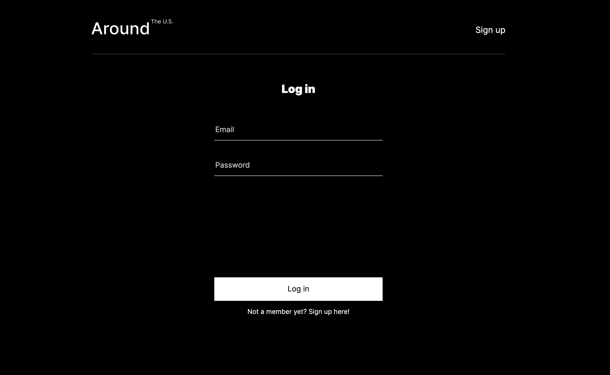
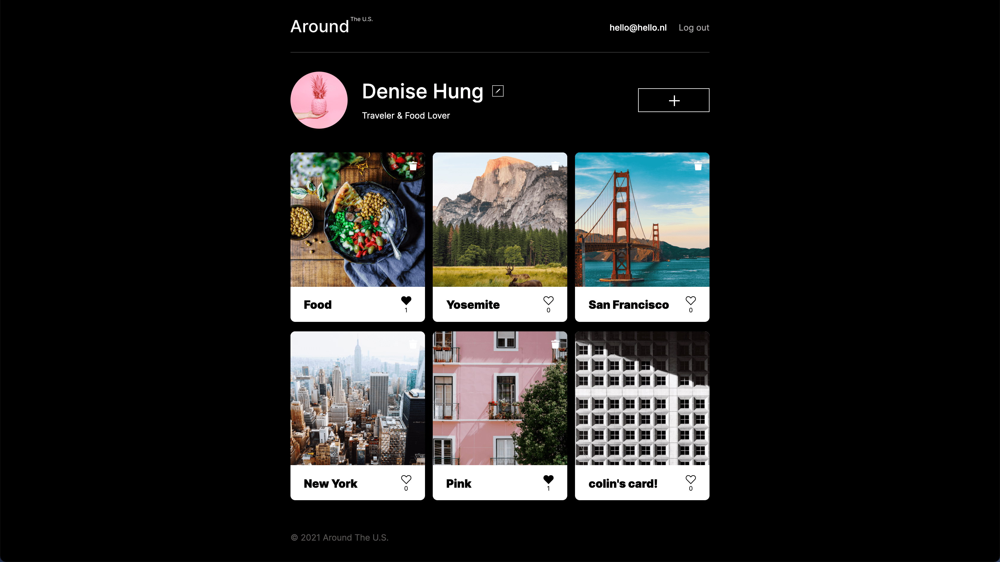
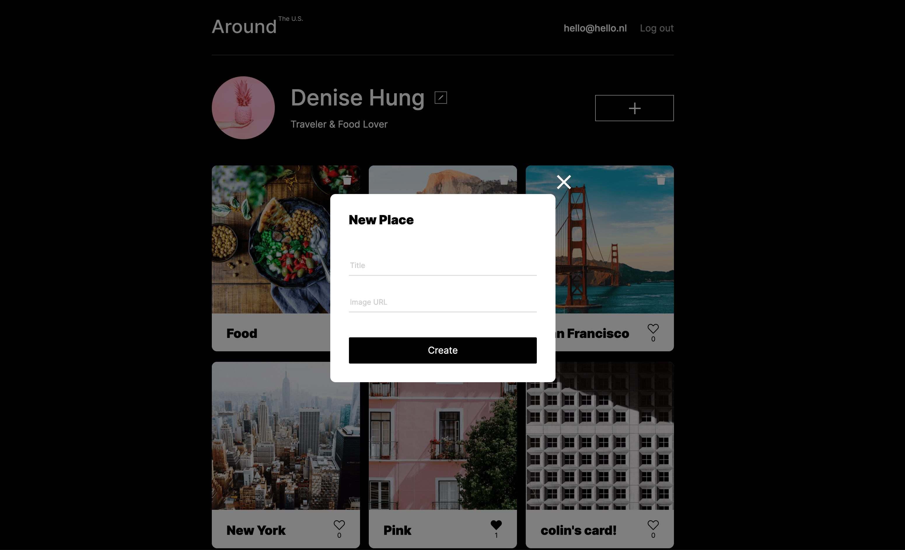
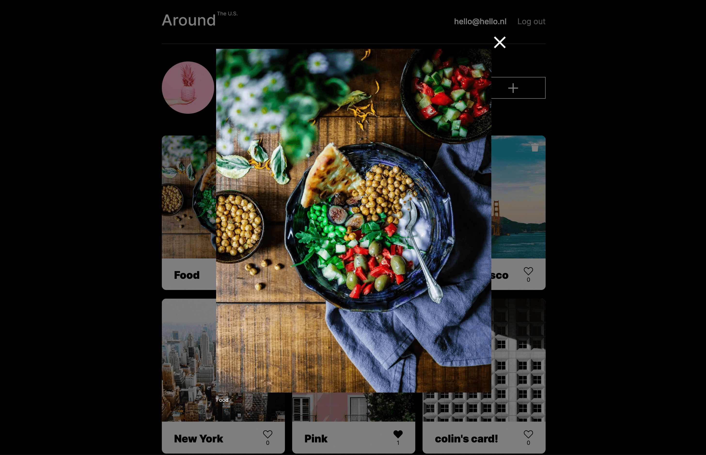

# Around The U.S.

## Intro

This project is part of the Practicum Web Development bootcamp (sprint 12 to 15). It's an interactive React application called 'Around The U.S.' where users can add, remove and like image cards. The frontend is connected to a self-built API that handles these functionalities, as well as user registration and authorization.

The page is hosted on **Google Cloud**.

## [**View live project**](https://dhung.students.nomoreparties.site/) :rocket:

## Project description
* Users can create an account and post their images on the page, which functions as a photo wall shared with other users.
* The page consists of image cards which are rendered from an API server. User info and card data is stored in a MongoDB database.
* A token is saved in the user's localStorage, so signed in users can access the homepage directly without having to login again.
* New cards can be added by submitting a popup form that requires a title and an image URL as inputs. When the user clicks on the card, a modal window with full size image and image caption will open.
* Each card has a like button and a like counter that keeps track of the number of likes. Cards can also be unliked.
* Only cards that were added by the user itself can be deleted. A bin icon is displayed on these cards; clicking on this icon will open a modal window to confirm if the user wants to delete the card.
* The user can change profile information (profile image, name and description) by submitting the edit form. 

## Used technologies

The project is created with:

* HTML
* CSS
* JavaScript (ES6)
* React
* Node.js
* MongoDB
* Express

## Screenshots
**Login and register screen**

**Main page with image gallery**

**Popup form to add image**

**Image popup**

